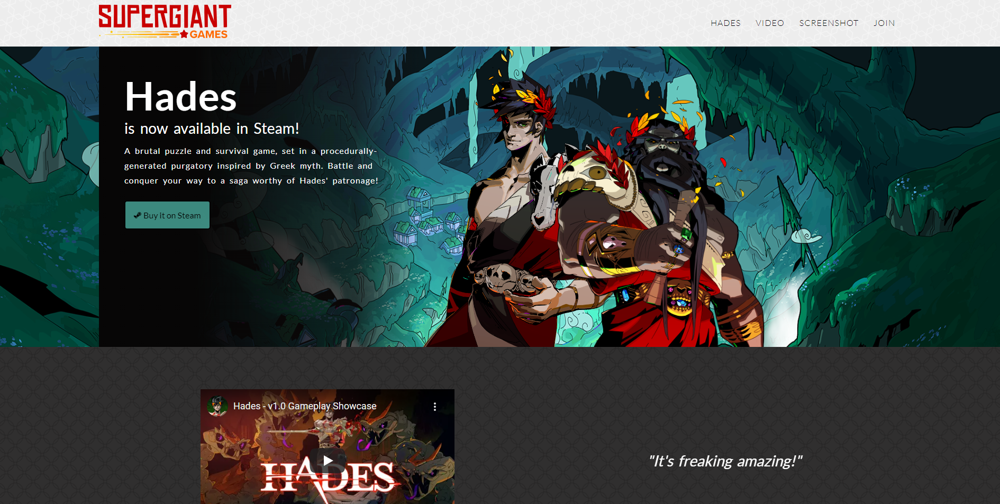
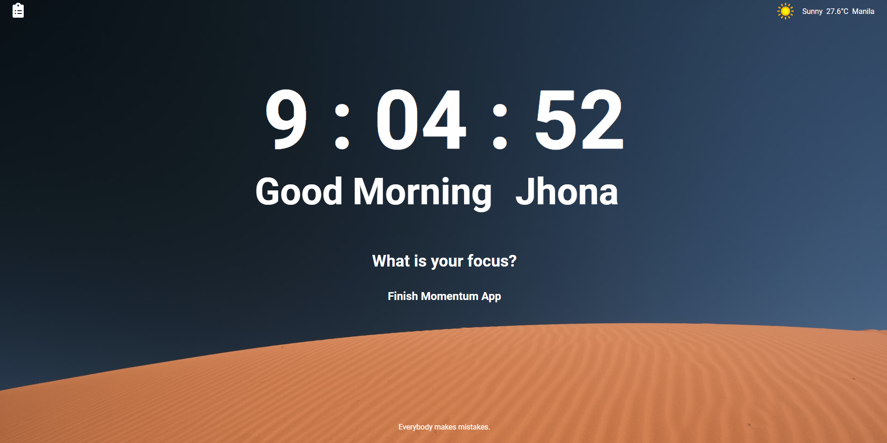
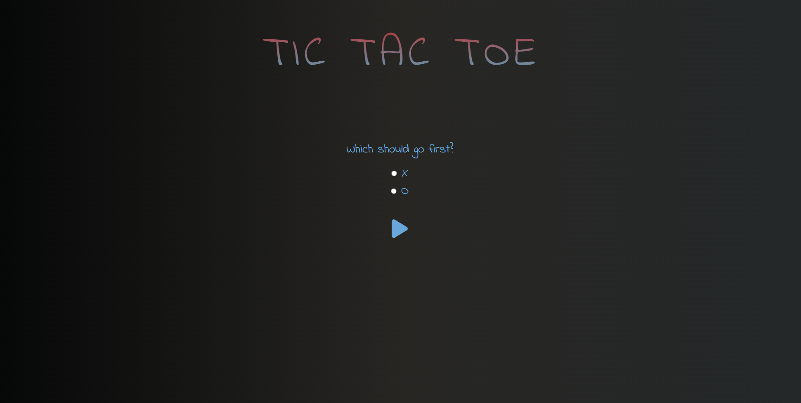
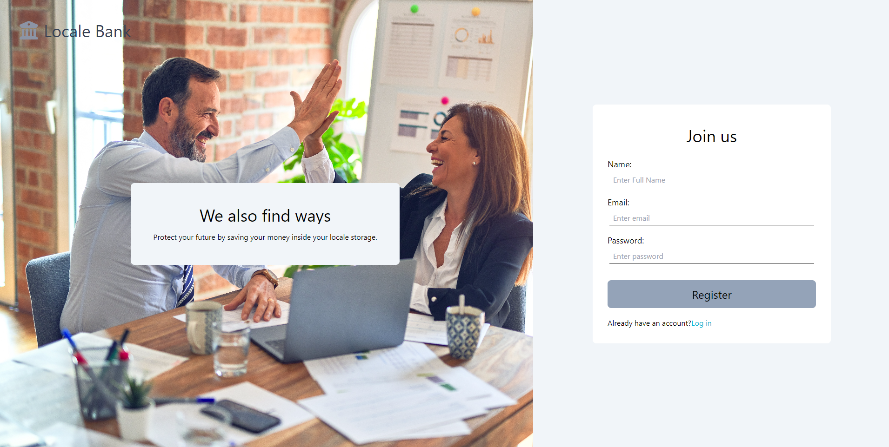
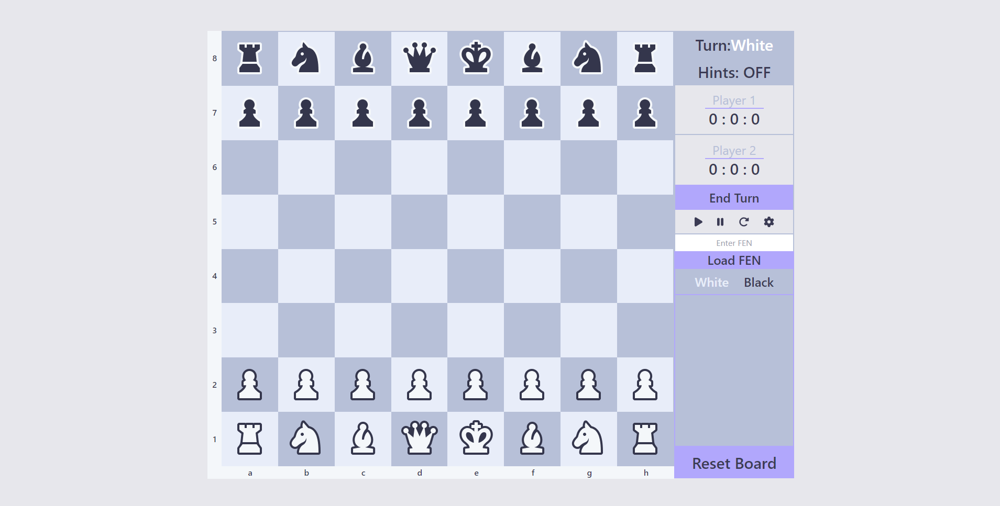
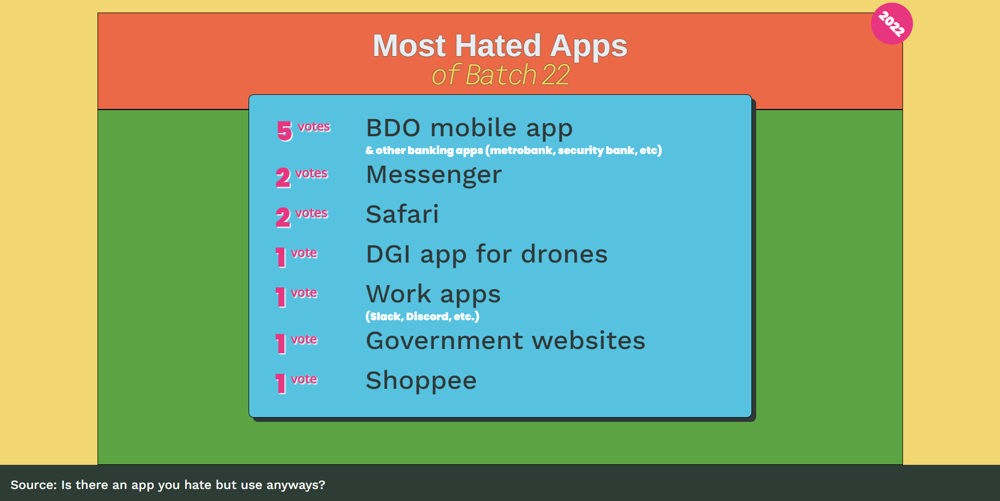
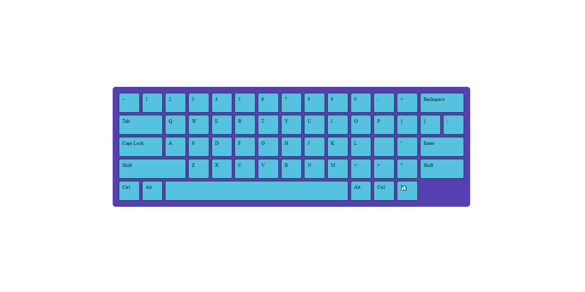

# Avion School activities

This repo is a representation of all the activities I completed throughout the duration of the Avion School Web Development Bootcamp

## Front-end activities

#### [1. Tribute Page Project ](https://jmnahan.github.io/batch22-fe-activities/tribute-project/)

#### [2. Forms Project ](https://jmnahan.github.io/batch22-fe-activities/forms-project/)

#### [3. Product Landing Page ](https://jmnahan.github.io/batch22-fe-activities/landing-page-project/)

#### [4. Momentum App ](https://jmnahan.github.io/batch22-fe-activities/momentum-app/)

#### [5. Tic-Tac-Toe App ](https://jmnahan.github.io/batch22-fe-activities/tic-tac-toe/)

#### [6. Bank App ](https://jmnahan.github.io/batch22-fe-activities/bank-app/)
##### Sample Accounts: 
1. First Account
    - email: juan@gmail.com
    - password: 12345678
    - account number: 215488233578

2. Second Account
    - email: maria@gmail.com
    - password: 12345678
    - account number: 817826505047

#### [7. Chessboard App (Collaboration project) ](https://jmnahan.github.io/batch22-fe-activities/chessboard-app/)
- [Code repo](https://github.com/Jmnahan/chessboard-app)

#### [8. Lax App/Slack App (Collaboration project) ]
- [Code repo](https://github.com/Jmnahan/lax-app)
1. Sample User:
    - email: testinguser11@das.com
    - password: 123456

#### [9. Flexbox Activity  ](https://jmnahan.github.io/batch22-fe-activities/flexbox-activity/)

#### [10. Grid Activity ](https://jmnahan.github.io/batch22-fe-activities/grid-activity/)

### JavaScript exercises

1. Intro to loops
    - [be-the-bouncer](https://github.com/Jmnahan/avion-school-activities)
    - [blue-team-vs-red-team](https://github.com/Jmnahan/avion-school-activities)
    - [color-my-chessboard](https://github.com/Jmnahan/avion-school-activities)

2. Intro to functions and methods
    - [help-wall-e](https://github.com/Jmnahan/avion-school-activities)
    - [schools-out](https://github.com/Jmnahan/avion-school-activities)
    - [whats-in-the-fridge](https://github.com/Jmnahan/avion-school-activities)

3. Intro to dom
    - [name-that-superpower](https://github.com/Jmnahan/avion-school-activities)

4. ES6 
   - [async-await](https://github.com/Jmnahan/avion-school-activities)
   - [catch-the-spy](https://github.com/Jmnahan/avion-school-activities)
   - [whats-my-address](https://github.com/Jmnahan/avion-school-activities)

## Back-end activities

#### [1. Blog App ](https://github.com/Jmnahan/blog)

#### [2. Journal App ](https://github.com/Jmnahan/journal_app)

#### [3. Trading App (Collaboration project) ](https://github.com/Jmnahan/trading_app)

#### [4. Capstone Project (Collaboration project) ]

### Ruby exercises

1. Data types 
    - [each](https://github.com/Jmnahan/avion-school-activities/blob/master/ruby-exercises/data_types_activity/each.rb)
    - [hash](https://github.com/Jmnahan/avion-school-activities/blob/master/ruby-exercises/data_types_activity/hash.rb)
    - [contact](https://github.com/Jmnahan/avion-school-activities/blob/master/ruby-exercises/data_types_activity/contact.rb)
    - [age](https://github.com/Jmnahan/avion-school-activities/blob/master/ruby-exercises/data_types_activity/age.rb)  

2. Control flow 
    - [check array](https://github.com/Jmnahan/avion-school-activities/blob/master/ruby-exercises/control_flow_activity/check_arr.rb)
    - [range](https://github.com/Jmnahan/avion-school-activities/blob/master/ruby-exercises/control_flow_activity/hundred.rb)
    - [while loop](https://github.com/Jmnahan/avion-school-activities/blob/master/ruby-exercises/control_flow_activity/options.rb)
    - [divisible by 2](https://github.com/Jmnahan/avion-school-activities/blob/master/ruby-exercises/control_flow_activity/divisible.rb)
 
3. OOP 
    - [inheritance](https://github.com/Jmnahan/avion-school-activities/blob/master/ruby-exercises/oop_activity/confection.rb)
    - [encapsulation](https://github.com/Jmnahan/avion-school-activities/blob/master/ruby-exercises/oop_activity/encapsulation.rb)
    - [abstaction](https://github.com/Jmnahan/avion-school-activities/blob/master/ruby-exercises/oop_activity/abstraction.rb)
    - [polymorph](https://github.com/Jmnahan/avion-school-activities/blob/master/ruby-exercises/oop_activity/polymorph.rb)
    - [missing code](https://github.com/Jmnahan/avion-school-activities/blob/master/ruby-exercises/oop_activity/missing_code.rb)
    - [make obj](https://github.com/Jmnahan/avion-school-activities/blob/master/ruby-exercises/oop_activity/make_obj.rb)

4. Postgresql
    - [sql students ](https://github.com/Jmnahan/avion-school-activities/blob/master/ruby-exercises/postgresql_activity/1_sql-students.txt)
    - [sql classrooms](https://github.com/Jmnahan/avion-school-activities/blob/master/ruby-exercises/postgresql_activity/2_sql-classrooms.txt)
    
5. SOLID Principle
    - [single responsibility](https://github.com/Jmnahan/avion-school-activities/blob/master/ruby-exercises/SOLID_activity/1_single_res.rb)
    - [open/closed](https://github.com/Jmnahan/avion-school-activities/blob/master/ruby-exercises/SOLID_activity/2_open_close.rb)
    - [liskov substitution](https://github.com/Jmnahan/avion-school-activities/blob/master/ruby-exercises/SOLID_activity/3_liskov_sub.rb)
    - [interface segregation](https://github.com/Jmnahan/avion-school-activities/blob/master/ruby-exercises/SOLID_activity/4_int_seg.rb)
    - [dependency inversion](https://github.com/Jmnahan/avion-school-activities/blob/master/ruby-exercises/SOLID_activity/5_dep_inv.rb)

### Coding exercises
 - [Square of squares](https://github.com/Jmnahan/avion-school-activities/blob/master/ruby-exercises/coding_exercise/a_sqr_of_sqr.rb)
 - [Smallest interger](https://github.com/Jmnahan/avion-school-activities/blob/master/ruby-exercises/coding_exercise/b_smallest_int.rb)
 - [Postive and negatives](https://github.com/Jmnahan/avion-school-activities/blob/master/ruby-exercises/coding_exercise/c_pos_nega.rb)
 - [Hydrated](https://github.com/Jmnahan/avion-school-activities/blob/master/ruby-exercises/coding_exercise/d_hydrated.rb)
 - [Isograms](https://github.com/Jmnahan/avion-school-activities/blob/master/ruby-exercises/coding_exercise/e_isograms.rb)
 - [Uniq in order](https://github.com/Jmnahan/avion-school-activities/blob/master/ruby-exercises/coding_exercise/f_uniq_in_order.rb)
 - [Disemvowel](https://github.com/Jmnahan/avion-school-activities/blob/master/ruby-exercises/coding_exercise/g_disemvowel.rb)
 - [Century](https://github.com/Jmnahan/avion-school-activities/blob/master/ruby-exercises/coding_exercise/h_century.rb)
 - [Bart and Lisa](https://github.com/Jmnahan/avion-school-activities/blob/master/ruby-exercises/coding_exercise/i_bart_lisa.rb)
 - [Vowel code](https://github.com/Jmnahan/avion-school-activities/blob/master/ruby-exercises/coding_exercise/j_vowel_code.rb)
 - [Unique number](https://github.com/Jmnahan/avion-school-activities/blob/master/ruby-exercises/coding_exercise/k_uniqe_num.rb)
 - [Middle element](https://github.com/Jmnahan/avion-school-activities/blob/master/ruby-exercises/coding_exercise/l_middle_elem.rb)
 - [Sorted](https://github.com/Jmnahan/avion-school-activities/blob/master/ruby-exercises/coding_exercise/m_sorted.rb)
 - [Count letters](https://github.com/Jmnahan/avion-school-activities/blob/master/ruby-exercises/coding_exercise/n_count_letters.rb)
 - [Add one](https://github.com/Jmnahan/avion-school-activities/blob/master/ruby-exercises/coding_exercise/o_%2B1_arr.rb)
